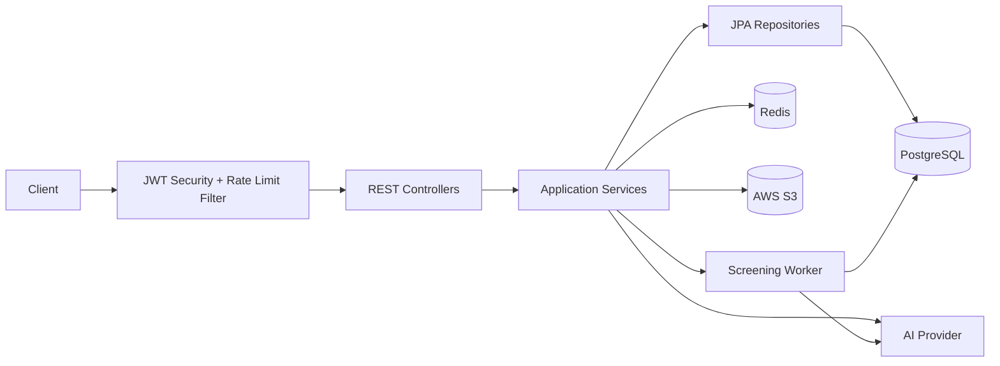

# AI Resume Screening API

Backend API for a resume screening workflow where candidates upload resumes and apply to jobs, while recruiters create job postings and queue AI-based screening.

This project is built as a Java/Spring Boot portfolio project with production-style concerns: JWT security, role-based authorization, PostgreSQL persistence, Flyway migrations, Redis rate limiting, AWS S3 file storage, async AI processing, and focused automated tests.

## What This Demonstrates

- Java 21 and Spring Boot layered backend architecture
- REST API design with DTOs and centralized error handling
- Spring Security with JWT authentication and role-based access
- PostgreSQL schema management with Flyway
- JPA entity modeling, including normalized required skills
- Redis-backed fixed-window rate limiting
- Async processing for long-running AI screening
- File upload, validation, text extraction, and S3 storage
- Unit, MVC, and Testcontainers-based integration testing

## Core Architecture



## Main Workflows

### Candidate Flow

1. Register/login as `CANDIDATE`.
2. Upload a PDF/DOCX resume.
3. Resume is validated, stored in S3, text is extracted, and AI parsing stores structured JSON.
4. Candidate applies to an active job using one of their resumes.
5. Candidate can view their own applications and withdraw them.

### Recruiter Flow

1. Register/login as `RECRUITER`.
2. Create jobs with required skills, experience level, employment type, and company details.
3. View applications for owned jobs.
4. Queue AI screening for one application or batch queue all applications for a job.
5. Poll screening status and view completed results, top candidates, recommendations, and stats.

## Screening Lifecycle

Screening is asynchronous.

- `POST /api/v1/screening/analyze` returns `202 Accepted`.
- Response includes `applicationId`, `jobPostingId`, `screeningStatus`, optional `screeningResultId`, and a message.
- Poll with `GET /api/v1/screening/application/{applicationId}/status`.
- Final states are `COMPLETED` or `FAILED`.

Screening statuses:

- `NOT_STARTED`
- `QUEUED`
- `PROCESSING`
- `COMPLETED`
- `FAILED`

## API Examples

### Register

```http
POST /api/v1/auth/register
Content-Type: application/json

{
  "email": "recruiter@example.com",
  "password": "Password@123",
  "fullName": "Recruiter One",
  "role": "RECRUITER",
  "companyName": "Acme"
}
```

### Create Job

```http
POST /api/v1/jobs
Authorization: Bearer <token>
Content-Type: application/json

{
  "title": "Java Backend Developer",
  "description": "Build REST APIs with Spring Boot",
  "requiredSkills": ["Java", "Spring Boot", "PostgreSQL"],
  "experienceLevel": "ENTRY",
  "employmentType": "FULL_TIME",
  "location": "Remote",
  "companyName": "Acme"
}
```

### Queue Screening

```http
POST /api/v1/screening/analyze
Authorization: Bearer <token>
Content-Type: application/json

{
  "applicationId": 42
}
```

Returns:

```json
{
  "success": true,
  "message": "Screening queued",
  "data": {
    "applicationId": 42,
    "jobPostingId": 10,
    "screeningStatus": "QUEUED",
    "screeningResultId": null
  }
}
```

## Rate Limiting

Rate limiting is enforced with Redis atomic counters.

- Login: 5 requests/minute/IP
- Register: 3 requests/minute/IP
- Public job endpoints: 60 requests/minute/IP
- Authenticated API: 120 requests/minute/user
- Resume upload: 10 requests/hour/user
- Screening: 20 requests/hour/recruiter
- Batch screening: 5 requests/hour/recruiter

Limit responses return `429 Too Many Requests` with:

- `Retry-After`
- `X-RateLimit-Limit`
- `X-RateLimit-Remaining`

## Database Migrations

Flyway migrations live in:

```text
src/main/resources/db/migration
```

Current migration themes:

- Baseline schema
- Normalized `job_required_skills`
- Async screening status columns
- Removal of legacy API usage table

Production profile uses:

```yaml
spring:
  jpa:
    hibernate:
      ddl-auto: validate
  flyway:
    enabled: true
```

## Local Setup

Required:

- Java 21
- Maven
- PostgreSQL
- Redis
- AWS S3 credentials
- AI provider API key

Environment variables:

```env
SPRING_DATASOURCE_URL=jdbc:postgresql://localhost:5432/resume_screening_db
SPRING_DATASOURCE_USERNAME=postgres
SPRING_DATASOURCE_PASSWORD=postgres
SPRING_DATA_REDIS_HOST=localhost
SPRING_DATA_REDIS_PORT=6379
AWS_S3_BUCKET_NAME=your-bucket
AWS_REGION=ap-south-1
AWS_ACCESS_KEY_ID=your-access-key
AWS_SECRET_ACCESS_KEY=your-secret-key
OPENAI_API_KEY=your-ai-key
JWT_SECRET=12345678901234567890123456789012
CORS_ALLOWED_ORIGINS=http://localhost:3000
```

Run:

```bash
mvn spring-boot:run
```

Swagger:

```text
http://localhost:8080/swagger-ui/index.html
```

## Testing

Run all tests:

```bash
mvn test
```

The test suite includes:

- Service unit tests with Mockito
- Standalone MVC/controller tests
- Redis rate limiter tests
- Testcontainers integration tests for PostgreSQL/Flyway/JPA and Redis

When Docker is not available, Testcontainers integration tests are skipped automatically.

## Project Structure

```text
src/main/java/com/resumescreening/api
├── config
├── controller
├── exception
├── model
├── repository
├── security
├── service
└── util
```

## Resume Bullet

Built a Spring Boot resume screening API with JWT authentication, recruiter/candidate role-based access, PostgreSQL/Flyway migrations, Redis rate limiting, AWS S3 resume storage, async AI screening, and automated unit/MVC/Testcontainers tests.
